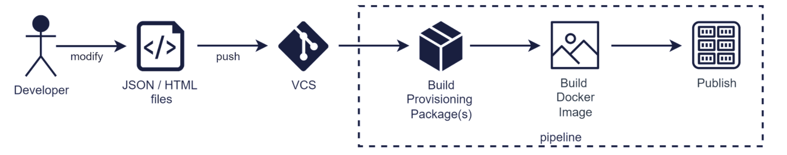

## Repository Overview
- This project is a collection with out-of-the box engagements data
- This project helps to build docker image with pre-populated Engagements data (your own set of customized Engage Defaults) and can be customized with customer-specific settings
- This project uses technologies broadly used in Backbase, like Docker

---
## Repository Description
This repository contains collections with out-of-the box engagements data.
These collections contain the following data:
- Events with general notifications
- Templates (general notifications and custom engagements)
- Repositories (for AWS S3 and Azure Blob Storage)

### Project Structure
This repository has the following structure:

```
├── .github                       
│   ├── actions                                                 # All GitHub Actions files
│   ├── ISSUE_TEMPLATE                                          # Templates for 'major','minor','patch' releases
│   └── workflows                                               # GitHub Actions workflows for CI
└── collections                   
    ├── retail                                                  # Retail collection
    │   ├── general-notifications                               # General notifications related collection
    │   │   ├── event-general-notifications     
    │   │   │   ├── {event-general-notifications-name}              
    │   │   │   │   ├── {general-notification-name}             # The folder to store channel specific data for general notifications   
    │   │   │   │   │   ├── in-app-notification                         
    │   │   │   │   │   │   ├── {locale}                        # The folder to store locale-specific engagement templates
    │   │   │   │   │   │   │   └── engagement-template.json    # The engagement template that contains default messages with the Handlebars expressions
    │   │   │   │   │   │   └── in-app_channel-settings.json    # The channel settings for in-app notification channels per locale
    │   │   │   │   │   └── push
    │   │   │   │   │       ├── {locale} 
    │   │   │   │   │       │   └── engagement-template.json 
    │   │   │   │   │       └── in-app_channel-settings.json     
    │   │   │   │   └── event-general-notifications.json        # The event with one or more general-notification definitions
    │   │   │   └── ... 
    │   │   ├── templates                                       # The folder to store templates
    │   │   │   ├── {template-name}
    │   │   │   │   ├── content-schema.json                     # A structure of an engagement template based on a given template
    │   │   │   │   └── template.json                           # A template definition
    │   │   │   └── ...
    │   │   └── placeholders                                    # The folder to store placeholder group
    │   │       ├── {placeholder-group-name}
    │   │       │   └── placeholders.json                       # A placeholder group configuration
    │   │       └── ...
    │   ├── custom-engagements                                  # Custom engagements related collection
    │   │    └── templates                                      # The folder to store templates
    │   │        ├── {template-name}
    │   │        │   ├── content-schema.json                    # A structure of an engagement template based on a given template (Specifies the path to image as {{contextRoot}}/assets/apple-pay.png)
    │   │        │   ├── template.json                          # A template definition
    │   │        │   └── assets                                 # Folder that contains all assets (index.html, image.png, thumbnail.png)
    │   │        │       ├── index.html                         # HTML file with embedded styling, expressions and templating language placeholders that should match the layoutPath property specified in the content schema
    │   │        │       ├── image.png                          # Images that are used within the template
    │   │        │       └── thumbnail.png                      # A representation of the rendered version of your template (recommended size: 164 x 217)
    │   │        └── ...
    │   ├── engagement-types                                    # The folder to store engagement types definition
    │   │    └── engagement-types                               
    │   │        └── engagement-types.json
    │   └── repositories                                        # The folder with a repository definition.
    │        ├── {repositories-type}                            #  Contains a repository that has a cloud storage (AWS S3 or Azure) as the underlying storage
    │        │    ├── {repository-name}
    │        │    │   ├── format.txt                            # Applicable package format
    │        │    │   ├── package.txt                           # List of items to be imported into a repository
    │        │    │   └── repository.xml                        # A repository definitions
    │        │    └── ...
    │        └── ...
    └── business                                                # Business collection
        ├── general-notifications                               # General notifications related collection
        │   ├── event-general-notifications     
        │   │   ├── {event-general-notifications-name}              
        │   │   │   ├── {general-notification-name}             # The folder to store channel specific data for general notifications   
        │   │   │   │   ├── in-app-notification                         
        │   │   │   │   │   ├── {locale}                        # The folder to store locale-specific engagement templates
        │   │   │   │   │   │   └── engagement-template.json    # The engagement template that contains default messages with the Handlebars expressions
        │   │   │   │   │   └── in-app_channel-settings.json    # The channel settings for in-app notification channels per locale
        │   │   │   │   └── push
        │   │   │   │       ├── {locale} 
        │   │   │   │       │   └── engagement-template.json 
        │   │   │   │       └── in-app_channel-settings.json     
        │   │   │   └── event-general-notifications.json        # The event with one or more general-notification definitions
        │   │   └── ... 
        │   ├── templates                                       # The folder to store templates
        │   │   ├── {template-name}
        │   │   │   ├── content-schema.json                     # A structure of an engagement template based on a given template
        │   │   │   └── template.json                           # A template definition
        │   │   └── ...
        │   └── placeholders                                    # The folder to store placeholder group
        │       ├── {placeholder-group-name}
        │       │   └── placeholders.json                       # A placeholder group configuration
        │       └── ...
        └── repositories                                        # The folder with a repository definition.
             ├── {repositories-type}                            #  Contains a repository that has a cloud storage (AWS S3 or Azure) as the underlying storage
             │    ├── {repository-name}
             │    │   ├── format.txt                            # Applicable package format
             │    │   ├── package.txt                           # List of items to be imported into a repository
             │    │   └── repository.xml                        # A repository definitions
             │    └── ...
             └── ...
```

### Repository definition configuration
For customers that only use **Headless General Notification** and will not migrate to **Premium** license Backbase recommends using `private` instead of `protected` repository definition for `engagement-template-general-notification` repository.

Example:
```xml
<ns2:repositories
  xmlns:ns2="http://www.backbase.com/content/model/1.0">
  <ns2:repository>
    <ns2:repositoryId>engagement-template-notification</ns2:repositoryId>
    <ns2:name>Engagement Template General Notification Repository</ns2:name>
    <ns2:description>Repository to store engagement templates for engagements where engagement is general notification</ns2:description>
    <ns2:isPrivate>true</ns2:isPrivate>
    <ns2:implementation>s3</ns2:implementation>
    <ns2:c3RepositoryId>engagement-template-notification</ns2:c3RepositoryId>
    <ns2:versioningEnabled>false</ns2:versioningEnabled>
  </ns2:repository>
</ns2:repositories>
```

### Event General Notifications
A general notification template defines the structure of a general notification sent to bank customers, including its name, description, title, engagement type, channel, and corresponding placeholder groups.

```json
{
  "eventClassName": "com.backbase.dbs.messages.pandp.event.spec.v4.MessageReceivedEvent",
  "id": "message-received",
  "eventBusinessName": "Message Received",
  "recipientType": "internal",
  "extractor": "#this['recipient']",
  "generalNotifications": [
    ...
  ]
}
```

More information on [how to create a custom Event General Notification](documentation/EVENT_GENERAL_NOTIFICATIONS.md).

### UI Notification Preferences
There are two types of recipients of Genera Notifications Notifications. 
internal - This recipient type requires the event to include the user’s  internalId to be present in the trigger event.
subscription - This type of GN requires the user to opt in via a notification preference. 

If your GN is of type subscription you need to build a UI (Android, IOS, Web) that uses the pre-existing backend API, allowing users to opt-in to your GN.

More information on [how to build notification preferences UI for OOTB general notification](documentation/UI_WEB_NOTIFICATION_PPEFERENCES.md).

---
## Project dependencies
- Engagements Capability
- Provisioning Capability
- Document Storage Capability
- Provisioner

---
## SDLC

### Create Engagements data package 
To create new or modify existing *General Notification* you'll have to modify JSON files (event definition, templates, and content-schema, etc). Once changes to those files are pushed to the version control system, pipeline would automatically build provisioning packages and package them to the docker image:


Once projects clone the repo, the docker image should be built with the pipeline described above. Docker image will contain out-of-the-box *Engagements data* package, that can be used from day 1.

More information on [how to create custom General notifications](https://community.backbase.com/documentation/foundation_services/latest/create_general_notifications).

### Deploy Engagements data package
Engagements data and Provisioner images should be deployed to the environment. These 2 containers have shared volume. Provisioner would scan folders defined in its configuration and send provisioning packages found in those folders to Provisioning service. Provisioning service would distribute it to corresponding destinations (Engagement, Content Enricher)

More information on [how to provision Engagements data](https://community.backbase.com/documentation/foundation_services/latest/import_in_containerized_environment).

---
## How to build

Building *Engagements data* collection (your own set of customized Engage Defaults) is easy, just run the following maven command:
```bash
mvn clean install
```
Generated collections will be located under *target/assembly* folder.
In order to create docker image locally use *docker* profile:
```bash
mvn clean install -Pdocker
```

**_NOTE:_** applicable only for UNIX-based machines.

---
## Community Documentation

* Engage App (Premium version)
  * [Create a template for Engagements](https://community.backbase.com/documentation/engage_app/latest/create_engagement_template)
  * [How to create custom General notifications](https://community.backbase.com/documentation/engage_app/latest/create_general_notifications)
* Foundation (Headless General Notification)
  * [How to create custom General notifications](https://community.backbase.com/documentation/foundation_services/latest/create_general_notifications)
* [How to provision Engagements data](https://community.backbase.com/documentation/foundation_services/latest/import_in_containerized_environment)
* [How to import collections using Provisioner container](https://community.backbase.com/documentation/foundation_services/latest/import_collections_using_provisioner_container)

---
## Release Workflow

1. Clone the Engagements Data project from the GitHub repository.
2. Create a `feature/*` branch based on the `master` branch.
3. Create new or edit existing General Notifications or Message Center template definitions by copying and modifying the existing JSON and HTML files in your branch, for example, event definition, templates, content schema.
   > Backbase recommends using the `feature/` and `hotfix/` prefixes in branch names during development. This will trigger the corresponding out-of-the-box workflows.
4. Create a pull request based on your branch.

Every time the pipeline is run, the Docker image is built but not pushed into the Docker container registry. To push to Elastic Container Registry, credentials must be configured in `pom.xml` and `.github/workflows`.

| Property name          |Example |Description |
|------------------------|-------|------------|
| `project.version`      | • `0.1.0` is used in the `master` branch | This property may vary depending on the branch you are working on. The deployment pipeline automatically changes the version property depending on the branch. |
| `backbase-bom.version` |`2022.11`|This is defined in the parent `pom.xml` file and matches the released Backbase version.|

To build the Docker image, take one of the following actions:
1. Merge your pull request to the `master` branch.
> The format of the `project.version` property is `X.Y.Z`.
2. The Engage Defaults collection is packaged and the Docker image is created, for example `engagements-data-retail:2022.11-0.10.0` and `engagements-data-sme:2022.11-0.10.0`.
> This is not pushed to the Docker container registry, unless you configure credentials in `pom.xml`
and `.github/workflows`.
3. After the PR is merged to the `master` branch, `project.version` is automatically increased based on the type of the source branch:
* **Minor release**: a pull request is raised from the `feature/*` branch.
* **Hotfix release**: a pull request is raised from the `hofitx/*` branch.
> The `hotfix/*` branch is only available for the latest version on the master branch.

---
## Contributions
Please create a feature branch from develop and a PR with your contributions. Commit messages should follow [semantic commit messages](https://seesparkbox.com/foundry/semantic_commit_messages)